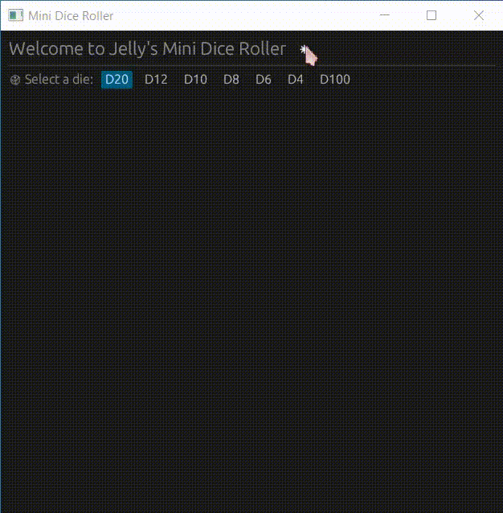

# :game_die: Mini Dice
A small **dice roller** written in Rust and using the [`egui`](https://github.com/emilk/egui) library.

## Demo


## 💜 A short introduction...
I started creating **Mini Dice** with the goal of learning . I wanted to integrate a simple interface with the help of the [`egui`](https://github.com/emilk/egui) library to provide a smooth experience for users.
<br>
The app is *fully-functional*, but I'm still looking to add more features in the future! I am a big fan of Tabletop Roleplaying Games (TTRPG), specifically [Pathfinder 2e](https://paizo.com/pathfinder), and I aim to turn this little dice roller into a multipurpose tool for TTRPG players to use.

## 🔨 How to run the app
The app is built with the Rust package manager, Cargo. Simply run the command:
```
cargo run --release
```